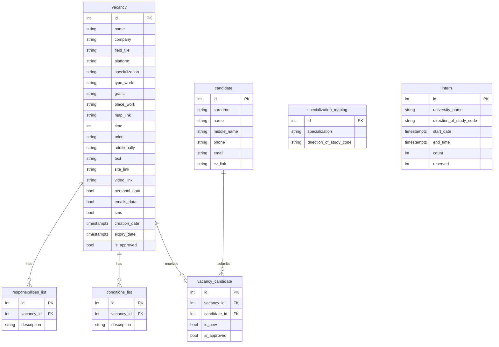

# Vacancies API v2.1.3

Проект демонстрирует сервис управления вакансиями и откликами. Стек включает FastAPI, SQLAlchemy 2.0, Alembic, PostgreSQL, Redis и вспомогательный модуль PGAdmin для администрирования базы данных в составе docker-compose.

Базовый макет проекта готов к расширению. Возможно добавлять новые маршруты, интегрировать аутентификацию или усложнять логику кэширования, используя уже настроенную инфраструктуру. На данный момент не имеется информации по струтктуре сервера авторизации и аутентификации пользователей, поэтому RBAC политика упущена и не рассматривалась в рамках решения.

## Возможности

- `GET /vacancies/?filter={company}` — выдача вакансий с фильтром по названию компании;
- `POST /vacancies/{id}/refresh` — продление вакансии с учётом количества продлений в Redis;
- `POST /university` — приём данных университетов о наборе стажёров (сохранение в Postgres + Redis);
- `GET /university/latest` — последние заявки университетов из Redis;
- `GET /metrics/summary` — агрегированные метрики для фронтенда (вакансии, отклики, уровень трудоустройства, топ-специальности, лидеры-компании; кешируются в Redis);
- `/health` — проверка доступности сервиса.

## Быстрый старт

```powershell
cp .env.example .env
docker-compose up --build -d
docker-compose exec api alembic upgrade head
```

Сервисы:

- API — http://localhost:8000 (`/docs` для Swagger);
- PGAdmin — http://localhost:5050 (учётные данные в `.env`, сервер подключается автоматически);
- PostgreSQL — `localhost:5432`;
- Redis — `localhost:6379`.

## Структура БД



## Redis

- кеширование списков вакансий по фильтру (`vacancies:list:*`);
- счётчики продлений вакансий (`vacancy:refresh:{id}`);
- очередь последних заявок университетов (`university:recent`), доступ на `/university/latest`;
- кеш агрегированных метрик (`metrics:summary`).

## Маршруты

| Метод | Путь | Описание |
|-------|------|----------|
| `GET` | `/vacancies/` | Список вакансий (кешируется в Redis на 5 минут). |
| `POST` | `/vacancies/{id}/refresh` | Продлевает `expiry_date`, увеличивает счётчик в Redis и очищает кеш списка. |
| `POST` | `/university` | Сохраняет сведения университета, добавляет запись в очередь Redis. |
| `GET` | `/university/latest` | Последние заявки университетов из Redis. |
| `GET` | `/metrics/summary` | Агрегированные показатели для фронтенда. |
| `GET` | `/health` | Проверка доступности сервиса. |

Пример ответа `/vacancies/{id}/refresh`:

```json
{
  "vacancy_id": 1,
  "company": "TechCorp",
  "refresh_count": 3,
  "old_expiry_date": "2025-10-01T09:00:00+00:00",
  "new_expiry_date": "2025-11-01T09:00:00+00:00"
}
```

Пример ответа `/metrics/summary`:

```json
{
  "total_vacancies": 25,
  "total_applications": 120,
  "employment_rate": 65.5,
  "active_vacancies": 18,
  "completed_vacancies": 6,
  "moderation_vacancies": 1,
  "top_specializations": [
    { "specialization": "Backend", "applications": 40 },
    { "specialization": "Data Science", "applications": 25 }
  ],
  "top_companies": [
    {
      "company": "TechCorp",
      "vacancies": 4,
      "total_applications": 35,
      "approved_applications": 12
    },
    {
      "company": "Insight Labs",
      "vacancies": 3,
      "total_applications": 22,
      "approved_applications": 9
    }
  ]
}
```

## Миграции

1. `20251018_0001_init_schema.py` — структура таблиц.
2. `20251018_0002_seed_data.py` — тестовые данные.

Новая миграция: `alembic revision -m "message"`. Применить все: `alembic upgrade head`. Откатить одну: `alembic downgrade -1`.

## Разработка локально

```bash
python -m venv .venv
source .venv/bin/activate  # Windows: .venv\Scripts\activate
pip install -r requirements.txt
alembic upgrade head
uvicorn app.main:app --reload
```

Redis можно запустить отдельно:

```bash
docker run --rm -p 6379:6379 redis:7-alpine
```

