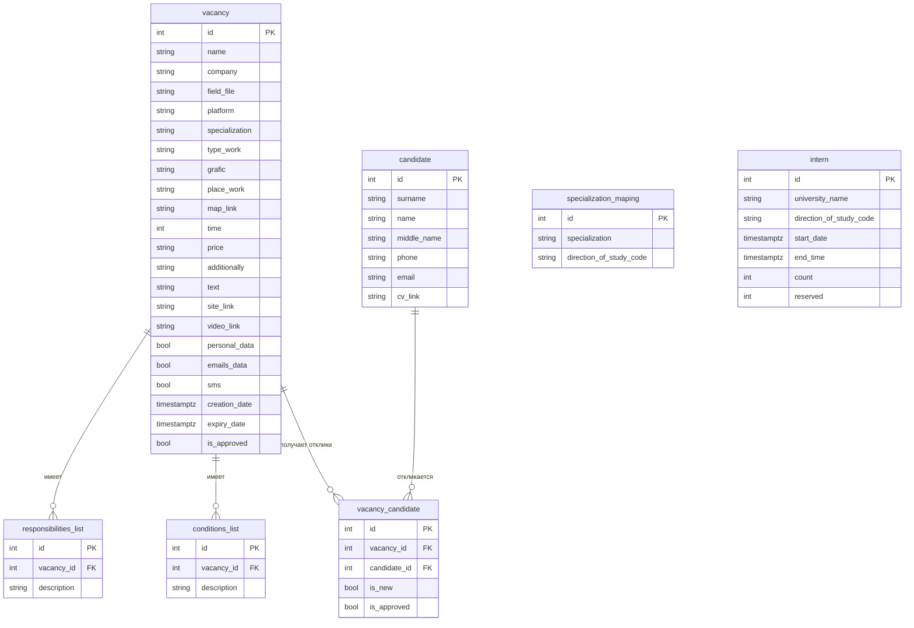

# Vacancies API v2.1.0

Проект демонстрирует сервис управления вакансиями и откликами. Стек включает FastAPI, SQLAlchemy 2.0, Alembic, PostgreSQL, Redis и вспомогательный модуль PGAdmin для администрирования базы данных в составе `docker-compose`.

Базовый макет проекта готов к расширению. Возможно добавлять новые маршруты, интегрировать аутентификацию или усложнять логику кэширования, используя уже настроенную инфраструктуру. На данный момент не имеется информации по струтктуре сервера авторизации и аутентификации пользователей, поэтому RBAC политика упущена и не рассматривалась в рамках решения.

## Возможности

- публикация списка вакансий с фильтром по компании
- продление срока истечения вакансии на месяц
- Alembic‑миграции для структуры и тестовых данных
- PGAdmin с автоконфигурацией для подключения к базе (на данный момент активна для разработки и в прод не пойдет)

## Быстрый старт

```powershell
# Клонируем репозиторий и копируем пример конфигурации
cp .env.example .env

# Собираем и поднимаем сервисы
docker-compose up --build -d

# Применяем миграции (структура + тестовые данные)
docker-compose exec api alembic upgrade head
```

Сервисы:

- API: http://localhost:8000
- PGAdmin: http://localhost:5050
- PostgreSQL: `localhost:5432` (`POSTGRES_USER` / `POSTGRES_PASSWORD` / `POSTGRES_DB`)
- Redis: `localhost:6379`

## Структура БД



## Маршруты API

| Метод | Путь | Описание |
|-------|------|----------|
| `GET` | `/vacancies/` | Возвращает вакансии, допускает фильтр `filter={company}` |
| `POST` | `/vacancies/{id}/refresh` | Продлевает `expiry_date` на месяц |
| `GET` | `/health` | Проверка доступности сервиса |

Ответ `/vacancies/`:

```json
{
  "vacancies": [
    {
      "id": 1,
      "name": "Стажёр Python разработчик",
      "company": "TechCorp",
      "specialization": "Backend",
      "creation_date": "2025-09-01T09:00:00Z",
      "expiry_date": "2025-10-01T09:00:00Z",
      "candidates": [
        {
          "candidate_id": 1,
          "is_new": true,
          "is_approved": false
        }
      ]
    }
  ]
}
```

В репозитории уже есть:

1. `20251018_0001_init_schema.py` — структура таблиц.
2. `20251018_0002_seed_data.py` — тестовые данные.

## Разработка локально (без Docker)

```bash
python -m venv .venv
source .venv/bin/activate  # Windows: .venv\Scripts\activate
pip install -r requirements.txt
alembic upgrade head
uvicorn app.main:app --reload
```